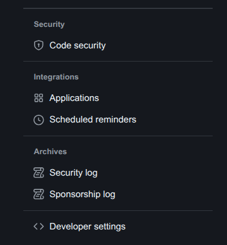
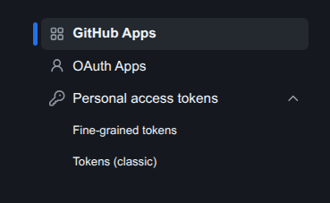
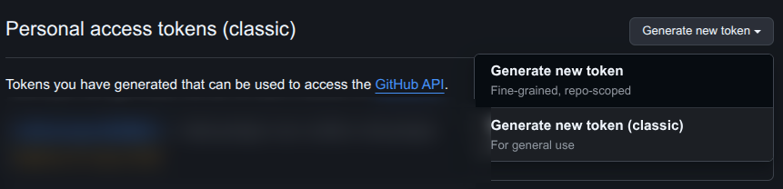
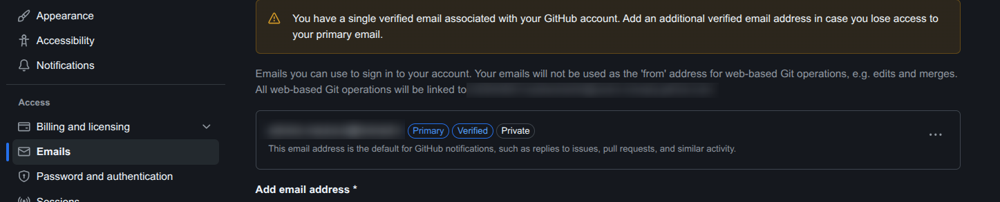
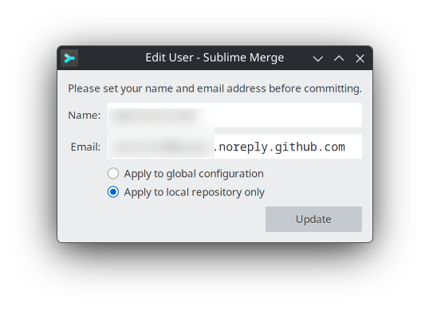
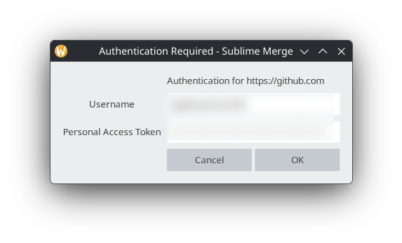
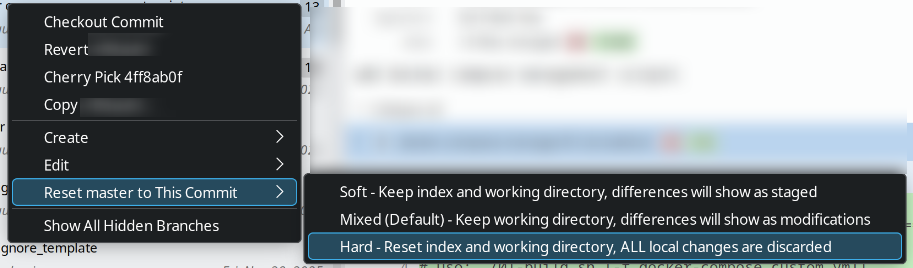
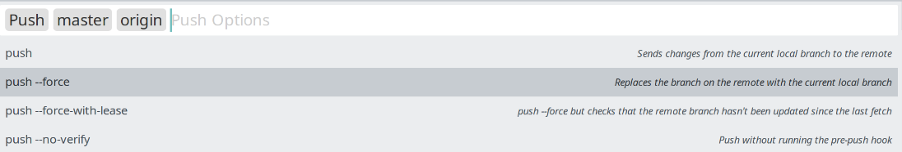

# Usare PAT (personal access token) per github

## Impostazioni github



## Impostazioni sviluppatore



## Impostazioni token classico

<!--  -->

### Generare un token classico

Impostare:

- nome comune per il PAT
- permessi

### Poi

**salvare il token, non verra' piu' visualizzato**

## Ottenere mail pubblica di github

impostazioni -> mail -> copiare la mail pubblica



## Login da applicazioni terze

**NON usare la mail privata ma il nome utente dell'account e la mail generata da github (noreply)**



Usare:

- nome utente, NON email dell'account
- mail noreply di github invece della mail privata
- chiave generata (PAT)
- consigliato: usare le info di accesso per il solo repo corrente

Inserire info di autenticazione quando richiesto



Le info di autenticazione sono:

- nome utente dell'account
- PAT generato in precedenza

# Eliminare credenziali dal repository

```bash
git config --unset credential.helper
```

# Revert commit

- usare PAT che dispone dei permessi di operare sul repo git

Effettuare reset



Effettuare hard push



<!--


-->

<!--
-->
